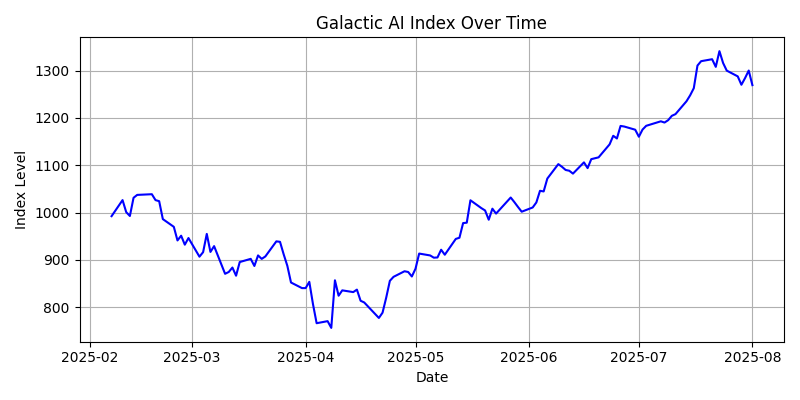

# 🚀 Galactic AI Index  
*A Custom Thematic Index Tracking the Growth of AI and Space Technology Sectors*

## 🧠 Overview  
The **Galactic AI Index** is a simulated, custom-built stock index tracking a basket of companies in the AI and space technology sectors. Designed to mirror real-world index production workflows, this project demonstrates **index construction**, **financial data handling**, and **automated data pipelines**, while integrating **Python, pandas, Excel**, and **SFTP/cloud simulation**.

This project simulates tasks similar to an **Index Production Analyst at Syntax**, such as index calculation, corporate action handling, periodic rebalancing, stakeholder reporting, and data dissemination.

---

## 🧱 Features

- 📊 **Custom stock universe** of AI and space-tech companies  
- 🧮 **Index calculation engine** using daily price data  
- 🔁 **Rebalancing logic** (monthly or quarterly)  
- 🛠️ **Automated pipeline** with SFTP simulation or GitHub Actions  
- 📈 **Excel & CSV reporting** for stakeholder-ready outputs  
- 🔍 **Data quality checks** and corporate action handling  
- 📦 **GitHub-ready documentation** and reproducible workflows

---

## 🎯 Project Goals

- Build and maintain a **custom index** (equal or weighted)
- Automate index value calculation using Python and pandas
- Export and version **daily index levels** and **constituent metadata**
- Simulate **SFTP-based data delivery**
- Produce stakeholder-facing **Excel/CSV reports**
- Showcase GitHub-based automation (e.g., GitHub Actions or AWS Lambda)

---

## ⚙️ Technologies Used

| Component        | Tools Used                         |
|------------------|------------------------------------|
| Data Handling    | Python, pandas, NumPy              |
| Index Logic      | pandas, vectorized math            |
| Data Ingestion   | yfinance, API wrappers, SFTP mock  |
| Automation       | GitHub Actions, cron, or AWS Lambda|
| Reporting        | Excel (OpenPyXL), CSV, matplotlib  |
| Version Control  | Git, GitHub                        |
| Documentation    | Markdown, Jupyter (optional)       |

---

## 📊 Results

> Below are selected outputs from the Galactic AI Index calculation as of the most recent run.

### 📈 Index Performance Summary
| Metric             | Value       |
|--------------------|-------------|
| Cumulative Return  | **+27.89%**  |
| Volatility (Annual)| **39.58%**   |
| Max Drawdown       | **27.18%**   |

> ℹ️ *These values are generated dynamically from the latest `index_history.csv` using Python + pandas.*

### 📉 Index Trend (Chart Preview)

  

> This chart shows the performance of the index starting from a base level of 1000 over the past 6 months. Index values are updated daily using historical price data from Yahoo Finance.

### 📁 Output Artifacts
- `index_history.csv` → Historical index levels and daily returns  
- `index_report.xlsx` → Summary stats, formatted tables  
- `index_plot.png` → Line chart visualization of index  
